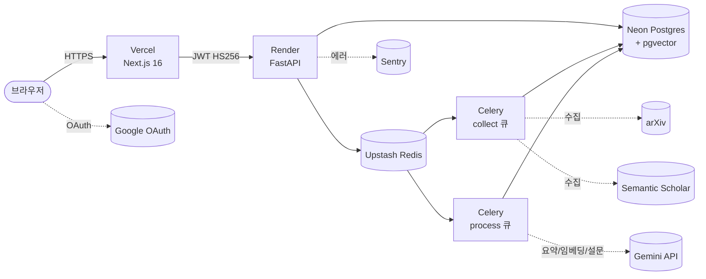

# academi.ai — 논문집필 도우미

> 한국 대학교 교수·박사과정 연구자를 위한 AI 기반 논문 작성 보조 서비스.
> 키워드 한 번으로 arXiv·Semantic Scholar에서 관련 논문을 모아 요약하고, **선행연구 기반 설문 문항**까지 자동 생성합니다.

🔗 **데모**: https://academi-ai.vercel.app
📍 **백엔드**: https://academi-ai.onrender.com (Render, Singapore region)
📅 **현재 단계**: Sprint 7 — 베타 배포 (2026-04 기준)

> 스크린샷 _(추후 추가 예정)_:
>  — 대시보드
>  — 설문 문항 자동 생성 화면

---

## 핵심 기능

| 기능 | 설명 |
|---|---|
| **논문 수집** | arXiv + Semantic Scholar 키워드 검색 → 메타데이터·초록 저장 |
| **요약 + 임베딩** | Gemini로 한국어 요약, `vector(1536)` 임베딩으로 유사 논문 검색 |
| **설문 문항 자동 생성** | 선행연구 문장에서 설문 문항을 추출·번안 (출처 페이지/연도 함께 보존) |
| **논문 건강검진** | 초안의 구성·근거·논리 흐름을 진단하고 보완 포인트 제시 |
| **연구 노트 → 초안** | 흩어진 노트를 챕터 초안으로 변환 |
| **버전 관리** | 자동 저장(최근 10개) + 수동 저장(무제한) |
| **연구 공백 발견** | 수집한 논문 군집에서 미탐색 영역 추천 |

---

## 기술 스택

- **프론트엔드**: Next.js 16 (App Router) + React 19 + Tailwind CSS 4 + next-auth (Google OAuth)
- **백엔드**: FastAPI + SQLAlchemy(async) + Alembic + Pydantic
- **DB**: PostgreSQL 16 + **pgvector** (`vector(1536)`)
- **큐**: Redis + Celery (`collect` / `process` 워커 분리)
- **AI**: Gemini API (`gemini-embedding-001`, 1536차원 — Matryoshka)
- **배포**: Vercel (프론트) + Render (백엔드/워커) + Neon (DB) + Upstash (Redis)
- **모니터링**: Sentry

---

## 아키텍처



**인증 플로우 요약**: Next.js(next-auth)가 Google OAuth 후 `NEXTAUTH_SECRET`으로 HS256 JWT 발급 → FastAPI는 같은 시크릿으로 **서명만 검증**(DB 조회 없음). 양쪽 시크릿이 byte-exact 일치해야 합니다. 자세한 내용은 [academi.md](academi.md) 참고.

**Celery 큐 분리**: `collect` 큐는 외부 API 레이트리밋 때문에 느리고(`sleep(3)` 필수), `process` 큐는 사용자 대기 작업이라 빠릅니다. 같은 워커에 섞으면 사용자 요청이 수집 작업 뒤에 막히므로 항상 분리 운영합니다.

---

## 로컬 개발 셋업

### 1. 사전 요구사항

- Docker Desktop (Compose v2)
- Node.js 20+ (프론트엔드 로컬 실행 시)
- Python 3.11+ (백엔드 직접 실행 시 — Docker 사용 시 불필요)

### 2. 환경변수

```bash
cp .env.example .env
```

`.env`를 열어 최소한 다음 값을 채웁니다:

| 변수 | 값 |
|---|---|
| `NEXTAUTH_SECRET` | `openssl rand -hex 32` |
| `GOOGLE_CLIENT_ID` / `GOOGLE_CLIENT_SECRET` | [Google Cloud Console](https://console.cloud.google.com/apis/credentials) |
| `GEMINI_API_KEY` | [Google AI Studio](https://aistudio.google.com/apikey) |
| `SS_API_KEY` | (선택) Semantic Scholar — 일 1,000건은 무인증으로 가능 |

### 3. 실행

```bash
docker-compose up -d            # db / redis / backend / celery_collect / celery_process / flower
npm install
npm run dev                     # http://localhost:3000
```

확인 포인트:

- http://localhost:3000 — Next.js 프론트
- http://localhost:8000/health — `{"status":"ok"}`
- http://localhost:8000/docs — FastAPI Swagger UI
- http://localhost:5555 — Flower (Celery 모니터링, `collect`/`process` 큐 분리 확인)

### 4. 테스트

```bash
docker-compose exec backend pytest                # 백엔드
npm run lint                                      # 프론트
```

`USE_FIXTURES=true`인 상태에서 pytest 실행 시 `backend/tests/fixtures/papers.json`의 시드 10편이 자동 시딩됩니다.

---

## 배포 가이드 (요약)

| 컴포넌트 | 호스트 | 비고 |
|---|---|---|
| 프론트엔드 | **Vercel** | `main` 브랜치 자동 배포. `NEXT_PUBLIC_API_URL`은 빌드타임 임베드라 변경 시 재배포 필수 |
| 백엔드 API | **Render** (Singapore) | `render.yaml` 기반. `start.sh` → uvicorn |
| 워커 | **Render Background Worker** | `collect` / `process` 큐 별도 서비스 |
| DB | **Neon** | `pgvector` extension 활성화 후 alembic migrate |
| Redis | **Upstash** | `rediss://` (TLS) URL 사용 |
| 모니터링 | **Sentry** | DSN을 양쪽 환경에 등록 |

배포 직후 반드시 [.github/CHECKLIST_ENV_VARS.md](.github/CHECKLIST_ENV_VARS.md)의 환경변수 점검 절차를 한 바퀴 돌리세요. **CORS_ORIGINS 누락**과 **NEXTAUTH_SECRET 불일치**가 가장 흔한 production 차단 원인입니다.

---

## 환경변수 표

`.env.example`이 정본입니다. 여기서는 운영자 시점에서 어디에 등록되어야 하는지를 정리합니다.

| 변수 | 위치 | 용도 |
|---|---|---|
| `NEXTAUTH_SECRET` | Vercel + Render (**byte-exact 일치**) | JWT HS256 서명/검증 공유 시크릿 |
| `NEXTAUTH_URL` | Vercel | next-auth 콜백 URL |
| `GOOGLE_CLIENT_ID` / `GOOGLE_CLIENT_SECRET` | Vercel | Google OAuth |
| `NEXT_PUBLIC_API_URL` | Vercel (빌드타임) | Render 백엔드 base URL — **trailing slash 금지**, `/api` 붙이지 말 것 |
| `CORS_ORIGINS` | Render | JSON 리스트, production Vercel 도메인 포함 필수 |
| `DATABASE_URL` | Render | Neon 커넥션 (`postgresql+asyncpg://...`) |
| `REDIS_URL` | Render | Upstash 커넥션 (`rediss://...`) |
| `GEMINI_API_KEY` | Render | 요약 + 임베딩(1536차원) |
| `SS_API_KEY` | Render (선택) | Semantic Scholar |
| `ANTHROPIC_API_KEY` | Render (선택) | 일부 expression 서비스에서만 사용 |
| `DEEPL_API_KEY` | Render (Phase 2) | 번역 — Phase 1에서는 비활성 |
| `SENTRY_DSN` | Vercel + Render | 에러 모니터링 |
| `CELERY_DISABLED` | Render web | `1`이면 동기 실행 (워커 미사용 시) |
| `USE_FIXTURES` | 로컬 | `true`면 pytest 시 시드 10편 자동 주입 |

자세한 점검 절차(byte-exact 비교, preflight 테스트, 흔한 실수 패턴)는 [.github/CHECKLIST_ENV_VARS.md](.github/CHECKLIST_ENV_VARS.md)에 있습니다.

---

## 문서 구조

| 파일 | 대상 | 내용 |
|---|---|---|
| **README.md** | 운영자·외부 방문자 | 서비스 소개, 셋업, 배포 |
| [academi.md](academi.md) | 개발자·Claude Code | 아키텍처 결정사항, DB 스키마, 코드 패턴 |
| [CLAUDE.md](CLAUDE.md) | Claude Code 세션 | 모델 정책, Next.js 16 주의사항 |
| [AGENTS.md](AGENTS.md) | 코딩 에이전트 일반 | 작업 원칙, 우선 읽을 파일 |
| [.github/CHECKLIST_ENV_VARS.md](.github/CHECKLIST_ENV_VARS.md) | 운영자 | production 환경변수 점검 |

---

## 기여

1인 개발 단계라 외부 PR은 받고 있지 않지만, 버그·개선 제안은 [Issues](https://github.com/hdj82-bot/academi.ai/issues)로 환영합니다.

코드 변경 시 원칙:

- 새 의존성 추가 전 합의 필요
- 기능 구현 시 pytest / RTL 테스트 동반
- 임베딩 차원 `vector(1536)` 변경 금지 (Phase 1)
- DB 스키마 변경은 Alembic 마이그레이션으로만
- 모든 코드는 **Claude Opus 4.7** (`claude-opus-4-7`, 1M context)로 작업 — 자세한 사유는 [CLAUDE.md](CLAUDE.md)

---

## 라이선스

현재 비공개 베타 단계로 라이선스 미지정입니다. 외부 사용·재배포는 별도 문의 바랍니다.
